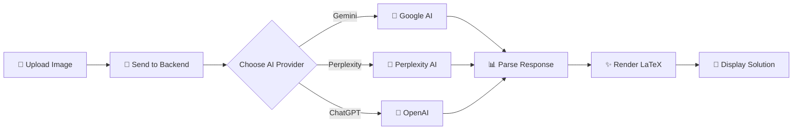

<div align="center">

# 🧮 LLM Math Solver

### Solve Any Math Problem with AI-Powered Vision

[](https://github.com/muzaddid-faruque/llm-math-solver/actions/workflows/python-ci.yml)
[](LICENSE)
[](https://www.python.org/downloads/)
[](https://reactnative.dev/)
[](https://expo.dev/)

**Upload a photo of any math problem and get instant, step-by-step solutions with beautifully rendered LaTeX equations.**

[Features](#-features) • [Quick Start](#-quick-start) • [Demo](#-how-it-works) • [API Docs](#-api-reference) • [Contributing](#-contributing)

</div>

---

## ✨ Features

<table>
<tr>
<td width="50%">

### 🎨 **Beautiful UI**
- Modern glassmorphism design
- Dark gradient theme
- Smooth animations
- Cross-platform (Web, iOS, Android)

### 🤖 **Multi-LLM Support**
- **Google Gemini** 2.5 Flash Image
- **Perplexity** Sonar Pro
- **OpenAI** GPT-4o-mini

</td>
<td width="50%">

### 📐 **Smart Math Solving**
- Image-to-solution conversion
- Step-by-step explanations
- LaTeX rendering with KaTeX
- Handles handwritten & printed problems

### 🛡️ **Production Ready**
- Rate limiting (10 req/min)
- File validation & security
- Robust error handling
- CI/CD pipeline

</td>
</tr>
</table>

---

## 🚀 Quick Start

### Prerequisites

| Component | Requirement |
|-----------|-------------|
| **Backend** | Python 3.10 or 3.11, pip |
| **Frontend** | Node.js v16+, npm/yarn |
| **API Keys** | At least one: [Gemini](https://makersuite.google.com/app/apikey), [Perplexity](https://www.perplexity.ai/settings/api), or [OpenAI](https://platform.openai.com/api-keys) |

### ⚡ 5-Minute Setup

#### 1️⃣ **Backend Setup**

```bash
# Navigate to backend
cd backend

# Create virtual environment
python -m venv venv

# Activate virtual environment
# Windows:
venv\Scripts\activate
# macOS/Linux:
source venv/bin/activate

# Install dependencies
pip install -r requirements.txt

# Configure environment variables
# Create a .env file with your API keys:
echo "GEMINI_API_KEY=your-key-here" > .env
echo "PERPLEXITY_API_KEY=your-key-here" >> .env
echo "OPENAI_API_KEY=your-key-here" >> .env

# Start the server
uvicorn main:app --reload --host 0.0.0.0 --port 8000
```

> ✅ Backend running at `http://localhost:8000`

#### 2️⃣ **Frontend Setup**

```bash
# Navigate to frontend
cd frontend/math-llm-frontend

# Install dependencies
npm install

# Start development server
npx expo start
```

**Launch Options:**
- Press `w` → Open in **web browser**
- Press `a` → Open in **Android emulator**
- Press `i` → Open in **iOS simulator**
- Scan QR code → Open in **Expo Go** app

---

## 🎯 How It Works



### User Flow

1. **Upload** - Select an image containing a math problem
2. **Choose** - Pick your preferred AI provider (Gemini/Perplexity/ChatGPT)
3. **Process** - AI analyzes the image and solves the problem
4. **View** - Get step-by-step solutions with beautifully rendered equations

---

## 📁 Project Structure

```
llm-math-solver/
├── 🔧 backend/                    # FastAPI Python backend
│   ├── main.py                    # API endpoints & LLM integration
│   ├── requirements.txt           # Python dependencies
│   └── venv/                      # Virtual environment
│
├── 🎨 frontend/                   # React Native + Expo frontend
│   └── math-llm-frontend/
│       ├── app/                   # Application screens
│       │   ├── (tabs)/
│       │   │   ├── index.tsx      # Main solver screen
│       │   │   └── explore.tsx    # Documentation
│       │   └── _layout.tsx        # Root layout
│       ├── components/            # Reusable components
│       ├── constants/             # Theme & config
│       └── package.json           # Dependencies
│
├── 🔄 .github/workflows/          # CI/CD automation
└── 📄 README.md                   # You are here!
```

---

## 🔌 API Reference

### Base URL
```
http://localhost:8000
```

### Endpoints

#### `GET /`
Health check endpoint.

**Response:**
```json
{
  "message": "Backend running. POST to /solve-gemini or /solve-perplexity or /solve-chatgpt"
}
```

#### `POST /solve-gemini`
Solve using Google Gemini 2.5 Flash Image.

**Request:**
- `file` (multipart/form-data): Image file (JPEG, PNG, WebP, GIF)
- Max size: 10MB

**Response:**
```json
{
  "raw": "...",
  "parsed": {
    "latex": "\\int_{0}^{\\pi} \\sin(x) \\, dx",
    "answer": "2",
    "steps": [
      "Step 1: Identify the integral",
      "Step 2: Apply the antiderivative",
      "Step 3: Evaluate at bounds"
    ],
    "notes": ""
  }
}
```

#### `POST /solve-perplexity`
Solve using Perplexity Sonar Pro.

**Request/Response:** Same format as `/solve-gemini`

#### `POST /solve-chatgpt`
Solve using OpenAI GPT-4o-mini.

**Request/Response:** Same format as `/solve-gemini`

### Rate Limits
- **10 requests per minute** per endpoint
- Returns `429 Too Many Requests` if exceeded

---

## 🛠️ Technology Stack

### Backend
| Technology | Purpose |
|------------|---------|
| **FastAPI** | Modern Python web framework |
| **Uvicorn** | ASGI server |
| **Google GenAI SDK** | Gemini API integration |
| **Requests** | HTTP client for Perplexity/OpenAI |
| **SlowAPI** | Rate limiting |
| **Python-dotenv** | Environment management |

### Frontend
| Technology | Purpose |
|------------|---------|
| **React Native** 0.81.5 | Cross-platform framework |
| **Expo** ~54.0.25 | Development platform |
| **TypeScript** | Type safety |
| **KaTeX** | LaTeX rendering |
| **Expo Router** | File-based routing |
| **Linear Gradient** | Beautiful gradients |
| **WebView** | Native LaTeX display |

---

## 🎨 UI Showcase

### Design Highlights

- **🌈 Gradient Theme**: Dark blue gradient background with vibrant accent colors
- **💎 Glassmorphism**: Semi-transparent cards with backdrop blur
- **🎯 Icon-Enhanced**: Each AI provider has unique gradient colors and icons
  - **Gemini**: Blue/Green gradient with Google icon
  - **Perplexity**: Purple gradient with flash icon
  - **ChatGPT**: Teal gradient with robot icon
- **📱 Responsive**: Adapts beautifully to all screen sizes

---

## 🔧 Configuration

### Environment Variables

Create a `.env` file in the `backend/` directory:

```env
# API Keys (at least one required)
GEMINI_API_KEY=your-gemini-key-here
PERPLEXITY_API_KEY=pplx-your-key-here
OPENAI_API_KEY=sk-your-openai-key-here

# Optional Configuration
OPENAI_MODEL=gpt-4o-mini                                    # Default: gpt-4o-mini
ALLOWED_ORIGINS=http://localhost:3000,http://localhost:19006 # CORS origins
REQUEST_TIMEOUT=30                                          # API timeout in seconds
```

### Frontend Configuration

Update backend URL in the app (default: `http://localhost:8000`):
- Open the app
- Modify the "Backend URL" field
- Changes persist during the session

---

## 🐛 Troubleshooting

<details>
<summary><b>❌ Backend: "API key not configured"</b></summary>

**Solution:**
1. Ensure `.env` file exists in `backend/` directory
2. Verify API keys are correct and active
3. Check that keys have proper permissions
4. Restart the backend server after adding keys
</details>

<details>
<summary><b>❌ Frontend: "Cannot connect to backend"</b></summary>

**Solution:**
1. Verify backend is running: `http://localhost:8000`
2. Update backend URL in the app if different
3. Check firewall settings
4. For mobile: Use your computer's IP instead of `localhost`
</details>

<details>
<summary><b>❌ "Module not found" errors</b></summary>

**Solution:**
1. Ensure virtual environment is activated
2. Reinstall dependencies: `pip install -r requirements.txt`
3. For frontend: `npm install` or `npm ci`
</details>

<details>
<summary><b>❌ LaTeX not rendering</b></summary>

**Solution:**
1. Ensure internet connection (KaTeX loads from CDN)
2. Check browser console for errors
3. Try toggling debug mode to view raw responses
4. Verify the LaTeX syntax is valid
</details>

<details>
<summary><b>❌ Image picker not working</b></summary>

**Solution:**
1. Grant gallery access permissions
2. iOS simulator: Add images to Photos library first
3. Android emulator: Grant storage permissions
</details>

---

## 🧪 Development

### Running Tests

```bash
cd backend
pytest
```

### Linting

```bash
cd backend
flake8 .
```

### CI/CD

The project uses **GitHub Actions** for continuous integration:
- ✅ Runs on pushes and PRs to `main`
- ✅ Tests on Python 3.10 and 3.11
- ✅ Performs linting with flake8
- ✅ Runs pytest tests

See [`.github/workflows/python-ci.yml`](.github/workflows/python-ci.yml) for details.

---

## 🗺️ Roadmap

Future enhancements we're considering:

- [ ] 🌍 Multi-language support
- [ ] 📚 Solution history and bookmarking
- [ ] 📄 Export solutions as PDF
- [ ] 📸 Camera capture for web
- [ ] 💾 Offline mode with cached solutions
- [ ] 🎓 Support for more LLM providers
- [ ] 🖊️ Handwriting recognition improvements
- [ ] 📊 Analytics dashboard

---

## 🤝 Contributing

Contributions are welcome! Here's how you can help:

1. **Fork** the repository
2. **Create** your feature branch (`git checkout -b feature/AmazingFeature`)
3. **Commit** your changes (`git commit -m 'Add some AmazingFeature'`)
4. **Push** to the branch (`git push origin feature/AmazingFeature`)
5. **Open** a Pull Request

Please ensure:
- ✅ Code follows existing style conventions
- ✅ Tests pass (`pytest` for backend)
- ✅ Linting passes (`flake8` for backend)
- ✅ Documentation is updated if needed

---

## 📄 License

This project is licensed under the **MIT License** - see the [LICENSE](LICENSE) file for details.

---

## 🙏 Acknowledgments

- **Google Gemini** - For powerful image-to-text math solving
- **Perplexity AI** - For their Sonar API
- **OpenAI** - For ChatGPT API
- **KaTeX** - For beautiful LaTeX rendering
- **Expo Team** - For amazing React Native development experience

---

## 📞 Support

Having issues or questions?

1. 📖 Check the [Troubleshooting](#-troubleshooting) section
2. 🔍 Review existing [GitHub Issues](https://github.com/muzaddid-faruque/llm-math-solver/issues)
3. 🆕 Create a new issue with detailed information

---

<div align="center">

**Made with ❤️ by [muzaddid-faruque](https://github.com/muzaddid-faruque)**

⭐ Star this repo if you find it helpful!

[Report Bug](https://github.com/muzaddid-faruque/llm-math-solver/issues) • [Request Feature](https://github.com/muzaddid-faruque/llm-math-solver/issues)

</div>
